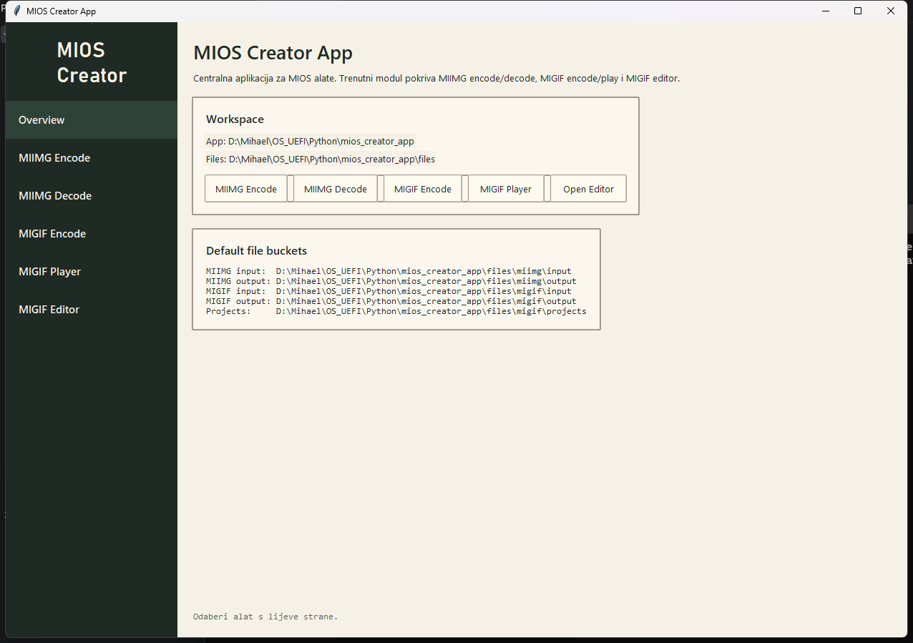
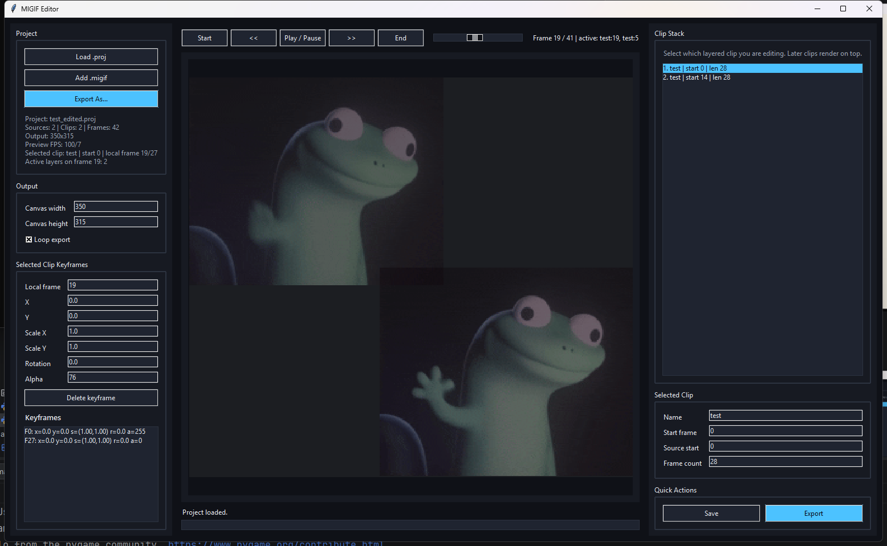
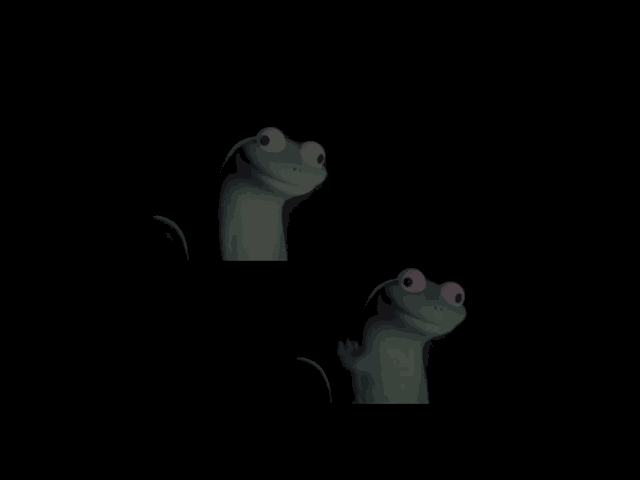

# MIOS Creator App

Desktop application for building parts of the MIOS ecosystem.

The current version focuses on the `MIIMG` and `MIGIF` formats, with room for future modules such as language tooling, operating-system utilities, and other creator-focused components.

## Preview

### Main application



### MIGIF Editor

`MIGIF Editor` opened with `test_edited.proj` on frame `19`:



### MIGIF playback example

This example shows alpha-channel animation together with two layered `MIGIF` video clips in playback:



The current multimedia module includes:

- a `MIIMG` encoder and decoder for still images
- a `MIGIF` encoder and player for animations
- a visual editor for building, previewing, and exporting `MIGIF` projects

## Format overview

### MIIMG

`MIIMG` is a custom single-image format with alpha-channel support.

In this implementation, each file contains:

- the `MII0` magic header
- image width and height
- a payload format identifier
- packed payload size
- pixel data stored as `BGRA` with simple `RLE` compression

The format is intended for compact storage of a raster image and straightforward decoding back into `RGBA`.

### MIGIF

`MIGIF` is a custom animation format designed for timeline-based playback.

In this implementation, it supports:

- a file header with canvas size, frame count, and FPS information
- an optional `PLTE` block for a global palette of up to 256 colors
- `FULL` frames for full-canvas image data
- `DELTA` frames for rectangular change regions only
- `TRANSFORM` frames for lightweight changes such as uniform alpha fades
- raw and `RLE` payloads for both `RGBA8888` and `INDEX8` data
- loop playback

In practice, `MIGIF` serves as a more flexible animation workflow than plain GIF within this project.

## Current features

- convert standard images into `MIIMG`
- decode `MIIMG` files back into viewable/exportable images
- convert `GIF` animations into `MIGIF`
- play `MIGIF` animations
- open, edit, and export projects through the `MIGIF` editor

## Requirements

- Python `3.10+`
- `tkinter` for the GUI
- packages listed in `requirements.txt`

Note: `tkinter` is usually included with the standard Windows Python installation. On some Linux distributions it must be installed separately.

## Installation

```powershell
python -m venv .venv
.venv\Scripts\Activate.ps1
pip install -r requirements.txt
```

## Running the GUI

From the project root:

```powershell
python .\app\main.py
```

## CLI tools

The current multimedia module also includes standalone scripts in `app/core/`:

- `miimg_encoder.py`
- `miimg_decoder.py`
- `migif_encoder.py`
- `migif_decoder.py`
- `migif_editor.py`

Examples:

```powershell
python .\app\core\miimg_encoder.py input.png output.miimg
python .\app\core\miimg_decoder.py input.miimg output.png
python .\app\core\migif_encoder.py input.gif output.migif
python .\app\core\migif_decoder.py input.migif
```

## Project structure

```text
mios_creator_app/
+-- app/
|   +-- main.py
|   +-- core/
|   `-- gui/
+-- files/
|   +-- miimg/
|   `-- migif/
+-- .gitignore
+-- README.md
`-- requirements.txt
```

## `files/` directory

The `files/` directory is part of the project and acts as both a workspace and a set of examples:

- `samples/` contains example input and output files
- `input/` is intended for local input files during use
- `output/` is intended for generated results
- `projects/` is intended for editor project files

## License

This project is licensed under the MIT License. See the `LICENSE` file for details.
